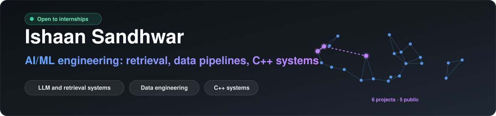
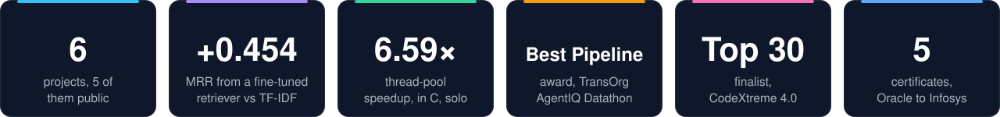
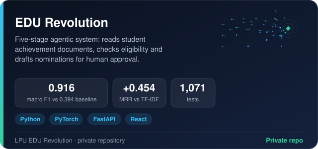
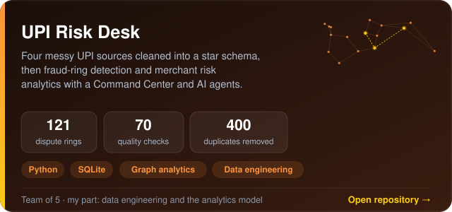
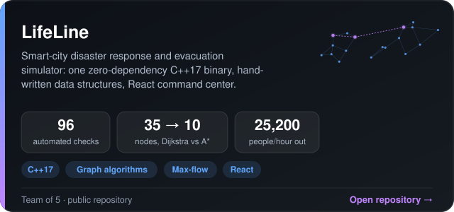
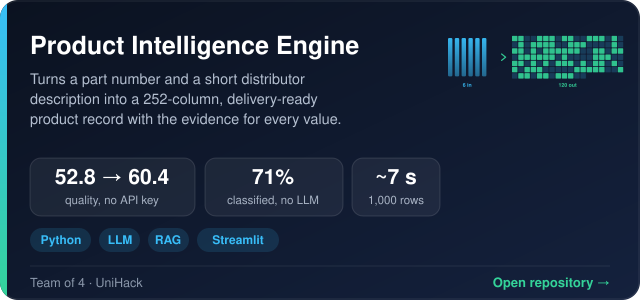
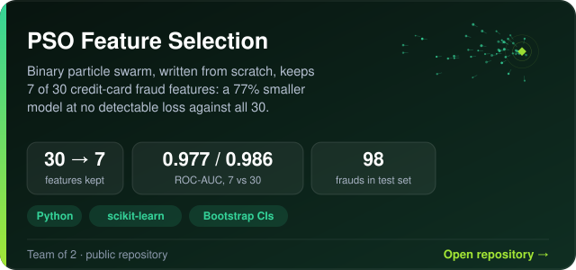
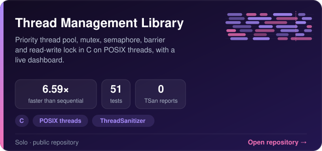
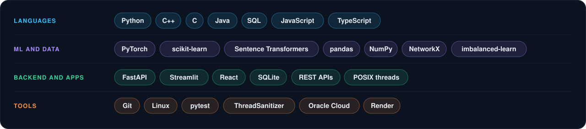
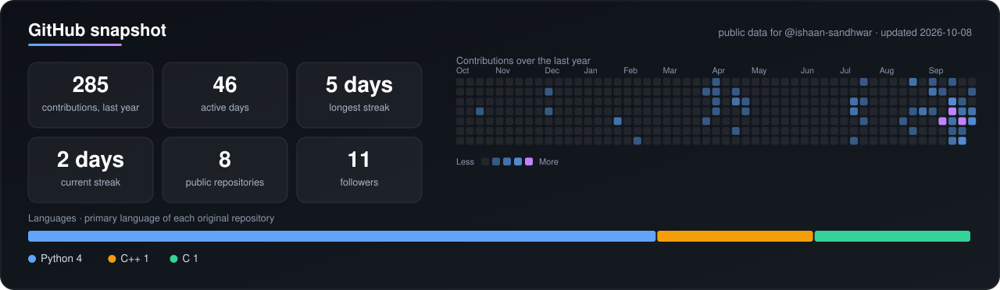

  

  <b>B.Tech CSE (AI/ML) at Lovely Professional University, Punjab, class of 2028. I build ML and data systems end to end (retrieval, LLM pipelines, data engineering, C++ systems) and report results with baselines and intervals.</b> 
  I check that each component earns its place with held-out splits and ablations. I once shipped a reranker switched off because the benchmark showed it did not transfer.

  &nbsp;
  &nbsp;
  

  

## 🧱 Selected work

  
  

  
  

  
  

Cards open the repository. Every number on a public card can be reproduced from that repository with its own commands, and team projects say how many of us built them. UPI Risk Desk opens my fork of the team leader's repository. Live demos: <a href="https://lifeline-31iq.onrender.com">LifeLine</a> · <a href="https://adityashukla2615.github.io/upi-risk-desk/outputs/upi_risk_desk.html?v=2">UPI Risk Desk Command Center</a>.

## 🧰 Toolbelt

  

**Learning now:** GATE Data Science and AI · advanced DSA in C++ · retrieval fine-tuning

  

## 💼 Experience

**AI Mentorship Intern** — Launched Global × Deevelo X · *May 2025 – Jun 2025*
Completed a structured AI/ML training programme followed by an assigned capstone project.

## 🏆 Achievements

|  | Title | Where | When |
| --- | --- | --- | --- |
| 🏆 | **Best Pipeline Award** — TransOrg AgentIQ Datathon, Track 1 (team entry) | TransOrg | 2026 |
| 🥉 | **Top 30 Finalist** — CodeXtreme 4.0 Java Coding Contest | Lovely Professional University × iamneo | 2026 |
| 🎖️ | **Participant** — Algo Arena 2.0, two-day coding competition | WeInnova8, hosted on TheEduCode | 2026 |

## 📜 Certifications

| Certification | Issuer | Date |
| --- | --- | --- |
| Oracle Cloud Infrastructure 2025 Certified AI Foundations Associate | Oracle University | Nov 2025 |
| Oracle Data Platform 2025 Certified Foundations Associate | Oracle University | May 2026 |
| DSA Placement Bootcamp — *Grade O* | LPU Centre for Professional Enhancement | Jul 2026 |
| Database Management System (Part I) | Infosys Springboard | Aug 2026 |
| Programming Using C++ | Infosys Springboard | Aug 2025 |

## 🎓 Education

| Degree | Institution | Duration |
| --- | --- | --- |
| **B.Tech, Computer Science & Engineering** Specialization: Artificial Intelligence & Machine Learning | Lovely Professional University | 2024 – 2028 |
| 12th Grade (Science) | Narayana E-Techno School, Mumbai | 2024 |

**Focus areas:** Information Retrieval & Dense Embeddings · Agentic LLM Systems · Classical ML & Optimisation · Data Structures & Algorithms

  

## 📊 GitHub stats

  

Built from public GitHub data by <code>scripts/github_stats.py</code>, with no third-party service; a workflow in this repository refreshes it every day.

  Outside of code I run a Discord community and play more games than I should admit. Hiring for ML, data or backend internships? The fastest way to reach me is email or LinkedIn above.

  

